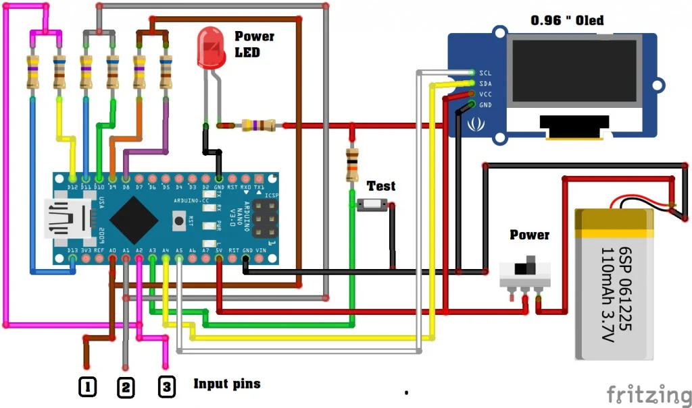

# Duino Tester

A basic component tester with Arduino Nano

## Hardware

| Name                             | Qty  |
| :------------------------------- | :--- |
| Arduino Nano                     | 1    |
| SSD1306 OLED Screen 128x64 0.96" | 1    |
| 470K Resistor                    | 3    |
| 680R Resistor                    | 3    |
| 10K Resistor                     | 1    |

## Software

- Adafruit_SSD1306
- Adafruit_GFX
- Wire
- SPI

## References

- https://maker.pro/arduino/projects/diy-super-simple-electronic-component-tester